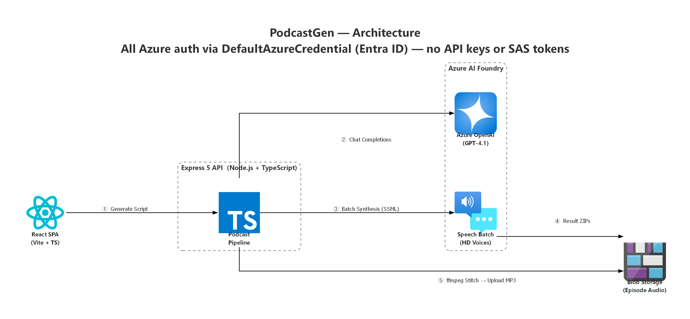

# PodcastGen

PodcastGen is a local-first Node.js + TypeScript app that:
1. Generates a two-speaker podcast script (~10 minutes)
2. Lets you review/approve the script
3. Sends approved SSML to Azure AI Speech Batch synthesis
4. Polls for completion, stitches chunk audio into a final MP3
5. Uploads the final file to Azure Blob Storage and returns a playable/downloadable URL

## Architecture



- `POST /scripts/generate` generates `Speaker A` / `Speaker B` script JSON
- `POST /episodes` accepts approved script and starts async synthesis
- `GET /episodes/:id` returns status and final URL when complete

### Frontend (`client/`)

A React + Vite + TypeScript SPA with:
- Script generation form (topic, title, tone, duration)
- Visual per-turn script editor with add/remove/reorder
- Synthesis controls with real-time progress polling
- Audio player and download
- Episode history list

In development, the Vite dev server proxies API routes to Express.

### Core modules
- `src/services/identity.ts` - DefaultAzureCredential singleton and bearer-token acquisition
- `src/services/ssml.ts` - SSML generation (multi-talker + fallback voices)
- `src/services/chunker.ts` - turn chunking for 2–6 minute segments
- `src/services/speechBatchClient.ts` - Batch synthesis REST operations
- `src/services/storage.ts` - download/upload helpers for Blob storage
- `src/services/stitcher.ts` - ffmpeg normalization + concatenation
- `src/services/podcastPipeline.ts` - end-to-end orchestration
- `src/services/episodeStore.ts` - local JSON metadata store (`data/episodes.json`)
- `src/services/auth.ts` - Express middleware for API key / JWT authentication

## Microsoft Learn-aligned implementation notes

This repo follows the Speech Batch approach from Learn docs:
- Batch synthesis API (async) with REST `2024-04-01`
- Job payload kept under limits by chunking
- Polling status until `Succeeded`/`Failed`
- `destinationContainerUrl` (SAS) for output storage
- TTL and output format set in batch properties

Important constraints used in code:
- Max create payload: 2 MB
- Max inputs/job: 10,000
- Max TTL: 744h (31 days)

## Prerequisites

- Node.js 22+
- `ffmpeg` in `PATH` (auto-installed in devcontainer)
- Azure AI Foundry account with Speech + OpenAI (deploy via `infra/main.bicep`)
- `az login` for local development (DefaultAzureCredential)
- RBAC roles: `Cognitive Services User` + `Storage Blob Data Contributor`

## Environment

Copy `.env.example` to `.env` and set values:

All Azure service calls authenticate via `DefaultAzureCredential` (Entra ID).
For local development, run `az login` before starting the server.

- `SPEECH_ENDPOINT` (custom-domain endpoint for your AI Foundry / Speech resource, e.g. `https://<account>.cognitiveservices.azure.com`)
- `SPEECH_REGION` (fallback when `SPEECH_ENDPOINT` is not set)
- `OUTPUT_CONTAINER_URL` (bare blob container URL, no SAS token needed)
- `OUTPUT_CONTAINER_PUBLIC_BASE_URL` (optional base URL for final playback URLs)
- Optional resilience values:
  - `RETRY_MAX_ATTEMPTS`
  - `RETRY_BASE_DELAY_MS`
  - `RETRY_MAX_DELAY_MS`
- Optional media ingress control:
  - `MEDIA_ALLOWED_HOSTS` (comma-separated allowlist for intro/outro hostnames)
- Optional API auth controls:
  - `AUTH_MODE` (`none`, `api-key`, `jwt`, `api-key-or-jwt`)
  - `API_KEYS` (comma-separated values when using API key modes)
  - `JWT_SECRET`
  - `JWT_ISSUER` (optional)
  - `JWT_AUDIENCE` (optional)
- Optional CORS restriction:
  - `CORS_ALLOWED_ORIGINS` (comma-separated exact origins)
- Optional AI generation values:
  - `AI_ENDPOINT`
  - `AI_DEPLOYMENT`
  - `AI_API_VERSION`

Voice defaults are preconfigured to HD voices:
- `MULTITALKER_VOICE=en-US-MultiTalker-Ava-Andrew:DragonHDLatestNeural`
- Fallback voices use `DragonHDOmniLatestNeural`

## Run locally

```bash
npm install
cd client && npm install && cd ..
```

Development (two terminals):
```bash
npm run dev              # API server on port 3000
cd client && npm run dev # Vite dev server on port 5173 (proxies to API)
```

Production:
```bash
cd client && npm run build && cd ..
npm run build
npm start
```

Open:
- `http://localhost:3000`

Workflow:
1. Generate script
2. Review/edit JSON
3. Start synthesis
4. Watch status update
5. Play/download audio once completed

Notes:
- Intro/outro URLs must be `https://`.
- For stricter environments, set `MEDIA_ALLOWED_HOSTS` to approved domains only.
- When `CORS_ALLOWED_ORIGINS` is set, only those origins can call the API from browsers.
- Enable API protection by setting `AUTH_MODE` and corresponding credentials.

## Devcontainer

This repo includes `.devcontainer` with:
- Node 22 TypeScript image
- `ffmpeg`
- Azure CLI

In VS Code: reopen in container, then run `npm run dev`.

## API quick examples

Generate script:

```bash
curl -X POST http://localhost:3000/scripts/generate \
  -H "Content-Type: application/json" \
  -d '{"topic":"AI for product teams","targetMinutes":10}'
```

Create episode:

```bash
curl -X POST http://localhost:3000/episodes \
  -H "Content-Type: application/json" \
  -d '{"title":"AI for product teams","script":[{"speaker":"A","text":"Welcome."},{"speaker":"B","text":"Great to be here."}]}'
```

Get status:

```bash
curl http://localhost:3000/episodes/<episodeId>
```

## Deploy Azure infrastructure

The `infra/` directory contains a Bicep template that deploys all required Azure resources:

| Resource | Purpose |
|---|---|
| AI Foundry account (AIServices, project-based) | OpenAI chat completions + Speech Batch synthesis |
| AI Foundry project | Project management in Foundry portal |
| OpenAI model deployment (gpt-4.1) | Script generation |
| Storage account + blob container | Episode audio output |
| Log Analytics workspace + diagnostic settings | Policy-required observability |
| RBAC role assignments | Managed-identity auth (no API keys needed) |

### Prerequisites

- Azure CLI with Bicep CLI installed (`az bicep install`)
- A subscription where you have Owner or Contributor + User Access Administrator

### Quick deploy

```bash
# Edit parameters (names must be globally unique)
nano infra/main.bicepparam

# Preview what will be created
az deployment sub what-if \
  --location eastus2 \
  --template-file infra/main.bicep \
  --parameters infra/main.bicepparam

# Deploy
az deployment sub create \
  --location eastus2 \
  --template-file infra/main.bicep \
  --parameters infra/main.bicepparam
```

### Post-deploy: populate .env

```bash
# Grab outputs
DEP=$(az deployment sub show -n main --query properties.outputs -o json)

# With disableLocalAuth=true (managed identity / Entra ID tokens):
AI_ENDPOINT=$(echo $DEP | jq -r .aiFoundryEndpoint.value)
SPEECH_ENDPOINT=$AI_ENDPOINT  # Same AIServices resource serves both OpenAI and Speech
SPEECH_REGION=$(echo $DEP | jq -r .speechRegion.value)
OUTPUT_CONTAINER_URL=$(echo $DEP | jq -r .outputContainerUrl.value)
AI_DEPLOYMENT=$(echo $DEP | jq -r .aiDeploymentName.value)

# With disableLocalAuth=false (API keys for local dev):
# SPEECH_KEY=$(az cognitiveservices account keys list -g rg-podcastgen -n podcastgen-ai --query key1 -o tsv)
# AI_API_KEY=$SPEECH_KEY  # same key for AIServices kind
```

### Policy-safe defaults

The template ships with settings that satisfy common enterprise policies:

- **`disableLocalAuth: true`** — satisfies `CognitiveServicesDisableLocalAuth` and `cognitiveServicesAccountsShouldHaveLocalAuthenticationMethodsDisabled`
- **`allowSharedKeyAccess: false`** — satisfies `storageAccountsShouldPreventSharedKeyAccess` and `StorageAccountDisableLocalAuth`
- **`modelSkuName: GlobalStandard`** — avoids `OpenAI_BlockProvisionedCapacity` deny
- **Diagnostic settings on all resources** — satisfies `EnableCognitiveServicesDiagnostics`, `EnableHubsAIFoundryDiagnostics`, `EnableProjectsAIFoundryDiagnostics`
- **`allowBlobPublicAccess: false`** — satisfies `StorageDisallowPublicAccess`
- **HTTPS-only + TLS 1.2** — satisfies `secureTransferToStorageAccountMonitoring`

Set `disableLocalAuth: false` and `allowSharedKeyAccess: true` in `infra/main.bicepparam` to allow API-key auth during local development.

## Cloud-ready next steps

- Persist metadata in Cosmos DB (currently uses a local JSON file)
- Move orchestration to Azure Functions or Container Apps job workers
- Add webhook/callback option instead of client polling
- Add CI/CD with `azd`
- Add automated tests
